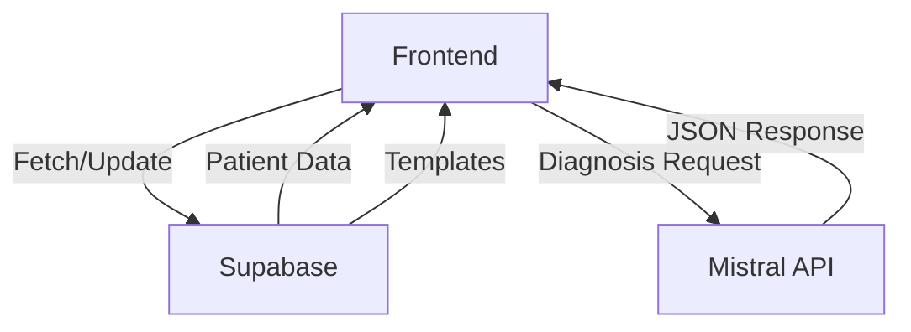

# **Medical Office MVP – Final Project Brief**
**Project Name:** *MediVIX*
**Objective:** Build a **React + Next.js** medical office MVP with **Mistral AI-powered diagnostics**, **visit templates**, and **AI follow-up suggestions**, using **shadcn/ui** for a modern, clean interface.

---

## **1. Project Overview**
### **Core Features**
| Feature                  | Description                                                                 | Priority |
|--------------------------|-----------------------------------------------------------------------------|----------|
| **Patient Management**   | CRUD for patients (name, DOB, contact, medical history)                   | High     |
| **Appointment System**   | Schedule/edit appointments with visit details (linked to patients)         | High     |
| **Patient History**      | Searchable timeline of past visits/diagnoses                              | High     |
| **AI Diagnosis Tool**    | Staff inputs symptoms → Mistral reviews history → suggests diagnoses       | High     |
| **AI Follow-Up Suggestions** | Mistral recommends next steps (tests, referrals, follow-ups)            | High     |
| **Visit Templates**      | Pre-saved forms for common visits (e.g., "Annual Physical")               | High     |
| **No Authentication**    | Skip for now (routes prepped for future auth)                              | Low      |

### **Tech Stack**
| Category       | Technology                          |
|----------------|-------------------------------------|
| **Frontend**   | Next.js (App Router), TypeScript, shadcn/ui |
| **Backend**    | Next.js API Routes                  |
| **Database**   | PostgreSQL (or Firebase for speed)  |
| **AI**         | Mistral API (`mistral-small` or `mistral-medium`) |
| **Styling**    | shadcn/ui + Tailwind CSS            |
| **State**      | React Query (data fetching)         |
| **UI Components** | shadcn’s `<Card>`, `<Table>`, `<Accordion>`, `<Popover>`, `<Command>` |

---

## **2. Database Schema**
### **Tables**
#### **1. Patients**
```sql
CREATE TABLE patients (
  id SERIAL PRIMARY KEY,
  first_name VARCHAR(255) NOT NULL,
  last_name VARCHAR(255) NOT NULL,
  dob DATE NOT NULL,
  phone VARCHAR(20),
  email VARCHAR(255),
  allergies TEXT[],
  chronic_conditions TEXT[],
  created_at TIMESTAMP DEFAULT NOW(),
  updated_at TIMESTAMP DEFAULT NOW()
);
```

#### **2. Appointments**
```sql
CREATE TABLE appointments (
  id SERIAL PRIMARY KEY,
  patient_id INTEGER REFERENCES patients(id),
  start_time TIMESTAMP NOT NULL,
  end_time TIMESTAMP NOT NULL,
  reason TEXT,
  status VARCHAR(20) DEFAULT 'scheduled', -- 'scheduled', 'completed', 'cancelled'
  notes TEXT,
  created_at TIMESTAMP DEFAULT NOW()
);
```

#### **3. Visit Templates**
```sql
CREATE TABLE visit_templates (
  id SERIAL PRIMARY KEY,
  name VARCHAR(255) NOT NULL,
  description TEXT,
  duration_interval INTERVAL NOT NULL, -- e.g., '30 minutes'
  default_notes TEXT,
  common_diagnoses TEXT[],             -- Optional: pre-linked to AI
  created_at TIMESTAMP DEFAULT NOW()
);
```

#### **4. Medical History**
```sql
CREATE TABLE medical_history (
  id SERIAL PRIMARY KEY,
  patient_id INTEGER REFERENCES patients(id),
  appointment_id INTEGER REFERENCES appointments(id),
  diagnosis TEXT,
  symptoms TEXT[],
  treatment TEXT,
  follow_up_notes TEXT,
  created_at TIMESTAMP DEFAULT NOW()
);
```

---
## **3. API Endpoints**
| Endpoint                | Method | Description                                  | Example Response                          |
|-------------------------|--------|----------------------------------------------|--------------------------------------------|
| `/api/patients`         | GET    | List all patients                            | `[{ id: 1, name: "John Doe", ... }]`       |
| `/api/patients`         | POST   | Create a new patient                         | `{ id: 2, name: "Jane Smith", ... }`       |
| `/api/patients/:id`     | GET    | Get patient details + history                | `{ patient: {}, history: [] }`             |
| `/api/appointments`     | GET    | List appointments (filter by date/patient)  | `[{ id: 1, patient_id: 1, ... }]`         |
| `/api/appointments`     | POST   | Create an appointment                        | `{ id: 2, patient_id: 1, ... }`           |
| `/api/diagnose`         | POST   | Call Mistral for diagnosis + follow-ups      | `{ diagnoses: [], followups: [] }`         |
| `/api/templates`        | GET    | List all visit templates                     | `[{ id: 1, name: "Annual Physical", ... }]` |
| `/api/templates`        | POST   | Create a new template                        | `{ id: 2, name: "Sick Visit", ... }`       |

---
## **4. UI/UX Components (shadcn/ui)**
### **A. Patient Management**
- **Patient List:** `<DataTable>` with search/filter.
- **Patient Card:**
  ```tsx
  <Card>
    <CardHeader>
      <div className="flex items-center gap-4">
        <Avatar>
          <AvatarFallback>{patient.initials}</AvatarFallback>
        </Avatar>
        <div>
          <CardTitle>{patient.name}</CardTitle>
          <div className="flex gap-2">
            {patient.allergies.map((allergy) => (
              <Badge variant="secondary" key={allergy}>
                {allergy}
              </Badge>
            ))}
          </div>
        </div>
      </div>
    </CardHeader>
    <CardContent>
      <Accordion type="single" collapsible>
        <AccordionItem value="history">
          <AccordionTrigger>Visit History</AccordionTrigger>
          <AccordionContent>
            <MedicalHistoryTimeline history={patient.history} />
          </AccordionContent>
        </AccordionItem>
      </Accordion>
    </CardContent>
  </Card>
  ```

### **B. Appointment System**
- **Calendar View:** `<Calendar>` + `<Popover>` for time slots.
- **Appointment Form:**
  ```tsx
  <form>
    <TemplatePicker onSelect={handleTemplateSelect} />
    <div className="grid grid-cols-2 gap-4">
      <div className="space-y-2">
        <Label>Patient</Label>
        <PatientCombobox onSelect={setPatient} />
      </div>
      <div className="space-y-2">
        <Label>Date & Time</Label>
        <div className="flex gap-2">
          <Input type="date" />
          <Input type="time" />
        </div>
      </div>
    </div>
    <div className="space-y-2">
      <Label>Notes</Label>
      <Textarea value={form.notes} onChange={(e) => setForm({...form, notes: e.target.value})} />
    </div>
    <Button type="submit">Save Appointment</Button>
  </form>
  ```

### **C. AI Diagnosis Tool**
- **Symptom Input:**
  ```tsx
  <div className="space-y-4">
    <div>
      <Label>Symptoms</Label>
      <Textarea
        placeholder="Describe symptoms (e.g., fever, cough, fatigue)..."
        value={symptoms}
        onChange={(e) => setSymptoms(e.target.value)}
      />
    </div>
    <Button onClick={handleDiagnose} disabled={!symptoms}>
      <Bot className="mr-2 h-4 w-4" />
      Analyze with AI
    </Button>
  </div>
  ```

- **AI Response:**
  ```tsx
  {aiResponse && (
    <>
      <DiagnosisCard diagnoses={aiResponse.diagnoses} />
      <FollowUpCard followups={aiResponse.followups} />
    </>
  )}
  ```

---
## **5. AI Integration Details**
### **Mistral Prompt Template**
```plaintext
You are a helpful medical assistant. Given the following patient history and current symptoms, provide:

1. **Top 3 Diagnoses**: Name and confidence percentage (0-100%).
2. **Follow-Up Recommendations**: Tests, referrals, or follow-up appointments with timing.

---
**Patient History**:
- Age: {age}
- Allergies: {allergies}
- Chronic Conditions: {chronic_conditions}
- Past Diagnoses: {past_diagnoses}

**Current Symptoms**:
{symptoms}

---
Format your response as JSON:
{
  "diagnoses": [{ "name": "Diagnosis Name", "confidence": 85 }, ...],
  "followups": [
    { "type": "test|referral|followup", "detail": "Description", "urgency": "low|medium|high" },
    ...
  ]
}
```

### **Example API Call (Next.js)**
```ts
// app/api/diagnose/route.ts
import { Mistral } from "@mistralai/mistralai";

export async function POST(request: Request) {
  const { symptoms, history } = await request.json();
  const mistral = new Mistral(process.env.MISTRAL_API_KEY!);

  const prompt = `...`; // Use the template above
  const response = await mistral.chat({
    model: "mistral-small",
    messages: [{ role: "user", content: prompt }],
    response_format: { type: "json_object" },
  });

  return Response.json(response.choices[0].message.content);
}
```

---
## **6. Visit Templates Implementation**
### **Example Templates to Seed**
```json
[
  {
    "name": "Annual Physical",
    "duration_interval": "30 minutes",
    "default_notes": "Check vitals, bloodwork, general exam. Update vaccinations if needed.",
    "common_diagnoses": ["Hypertension", "Hyperlipidemia"]
  },
  {
    "name": "Sick Visit (URI)",
    "duration_interval": "15 minutes",
    "default_notes": "Assess symptoms: fever, cough, congestion. Rapid strep test if indicated.",
    "common_diagnoses": ["Upper Respiratory Infection", "Sinusitis"]
  },
  {
    "name": "Vaccination",
    "duration_interval": "10 minutes",
    "default_notes": "Administer [vaccine name]. Observe for 15 minutes post-injection.",
    "common_diagnoses": []
  }
]
```

### **Template Picker Component**
```tsx
// components/template-picker.tsx
import { Popover, PopoverTrigger, PopoverContent, Command, CommandInput, CommandList, CommandItem } from "@/components/ui";

export function TemplatePicker({ onSelect }: { onSelect: (template: any) => void }) {
  const [templates, setTemplates] = useState([]);
  const [open, setOpen] = useState(false);

  useEffect(() => {
    fetch("/api/templates").then((res) => res.json()).then(setTemplates);
  }, []);

  return (
    <Popover open={open} onOpenChange={setOpen}>
      <PopoverTrigger asChild>
        <Button variant="outline" className="w-full justify-between">
          <PlusCircle className="mr-2 h-4 w-4" />
          Use Template
        </Button>
      </PopoverTrigger>
      <PopoverContent className="p-0" align="start">
        <Command>
          <CommandInput placeholder="Search templates..." />
          <CommandList>
            {templates.map((template) => (
              <CommandItem
                key={template.id}
                onSelect={() => {
                  onSelect(template);
                  setOpen(false);
                }}
              >
                {template.name}
                <span className="ml-auto text-xs text-muted-foreground">
                  {formatInterval(template.duration_interval)}
                </span>
              </CommandItem>
            ))}
          </CommandList>
        </Command>
      </PopoverContent>
    </Popover>
  );
}
```

---
## **7. Project Structure**
```
mediflow/
├── app/
│   ├── (protected)/          # Future auth wrapper
│   │   ├── patients/         # Patient management
│   │   ├── appointments/     # Scheduling
│   │   ├── diagnose/         # AI tool
│   │   └── templates/        # Visit templates
│   ├── api/                  # API routes
│   └── layout.tsx            # Main layout
├── components/               # shadcn UI components
│   ├── patient-card.tsx
│   ├── appointment-form.tsx
│   ├── diagnosis-card.tsx
│   ├── followup-card.tsx
│   └── template-picker.tsx
├── lib/
│   ├── db.ts                 # Database client
│   └── mistral.ts            # AI helper functions
├── public/                   # Static assets
└── styles/                   # Global CSS
```

---
## **8. Deployment Plan**
| Step               | Tool/Service               | Notes                                  |
|--------------------|---------------------------|----------------------------------------|
| **Frontend Hosting** | Vercel                    | Auto-deploy from GitHub                |
| **Backend Hosting** | Vercel (API Routes)       | Serverless functions                   |
| **Database**       | Supabase (PostgreSQL)     | Free tier + easy Next.js integration   |
| **Mistral API**    | Mistral AI                | Use `mistral-small` for cost efficiency |

---
## **9. Future-Proofing**
### **Authentication Prep**
- **Route Structure:**
  ```plaintext
  /app
    /(public)       # Future landing/login
    /(protected)    # Current MVP (wrapped in auth later)
  ```
- **Mock User Context:**
  ```tsx
  // lib/auth.ts
  export function useUser() {
    return { id: "1", role: "nurse", name: "Demo User" }; // Replace with real auth later
  }
  ```

### **HIPAA Compliance Prep**
- Add **audit logs** for patient data access.
- Use **environment variables** for all secrets (Mistral API key, DB URL).

Here’s your **final, execution-ready project brief** with all decisions incorporated (Supabase, `mistral-medium`, seeded templates). This is **ready to hand off to V0 AI** or a dev team with zero ambiguity:

---

# **MediFlow MVP – Final Technical Specification**
**Database:** Supabase (PostgreSQL)
**AI Model:** `mistral-medium`
**Templates:** Pre-seeded with 3 examples
**Deployment:** Vercel + Supabase

---

## **1. Project Setup Instructions**
### **A. Initialize Project**
```bash
# Create Next.js app with TypeScript
npx create-next-app@latest mediflow --typescript --eslint
cd mediflow

# Install dependencies
npm install @supabase/supabase-js @mistralai/mistralai @radix-ui/react-dropdown-menu @radix-ui/react-popover @radix-ui/react-command date-fns lucide-react react-query zod

# Add shadcn/ui components
npx shadcn-ui@latest add button card accordion table input textarea label badge popover command separator avatar calendar
```

### **B. Environment Variables**
Create `.env.local`:
```env
NEXT_PUBLIC_SUPABASE_URL=your-supabase-url
NEXT_PUBLIC_SUPABASE_ANON_KEY=your-supabase-key
MISTRAL_API_KEY=your-mistral-key
```

---
## **2. Supabase Database Setup**
### **SQL Schema (Run in Supabase SQL Editor)**
```sql
-- Enable UUID extension
CREATE EXTENSION IF NOT EXISTS "uuid-ossp";

-- Patients table
CREATE TABLE patients (
  id UUID PRIMARY KEY DEFAULT uuid_generate_v4(),
  first_name TEXT NOT NULL,
  last_name TEXT NOT NULL,
  dob DATE NOT NULL,
  phone TEXT,
  email TEXT,
  allergies TEXT[] DEFAULT '{}',
  chronic_conditions TEXT[] DEFAULT '{}',
  created_at TIMESTAMP WITH TIME ZONE DEFAULT NOW(),
  updated_at TIMESTAMP WITH TIME ZONE DEFAULT NOW()
);

-- Appointments table
CREATE TABLE appointments (
  id UUID PRIMARY KEY DEFAULT uuid_generate_v4(),
  patient_id UUID REFERENCES patients(id) ON DELETE CASCADE,
  start_time TIMESTAMP WITH TIME ZONE NOT NULL,
  end_time TIMESTAMP WITH TIME ZONE NOT NULL,
  reason TEXT,
  status TEXT DEFAULT 'scheduled' CHECK (status IN ('scheduled', 'completed', 'cancelled')),
  notes TEXT,
  created_at TIMESTAMP WITH TIME ZONE DEFAULT NOW()
);

-- Visit templates table (with seed data)
CREATE TABLE visit_templates (
  id UUID PRIMARY KEY DEFAULT uuid_generate_v4(),
  name TEXT NOT NULL,
  description TEXT,
  duration_minutes INTEGER NOT NULL DEFAULT 15,
  default_notes TEXT,
  common_diagnoses TEXT[] DEFAULT '{}',
  created_at TIMESTAMP WITH TIME ZONE DEFAULT NOW()
);

-- Medical history table
CREATE TABLE medical_history (
  id UUID PRIMARY KEY DEFAULT uuid_generate_v4(),
  patient_id UUID REFERENCES patients(id) ON DELETE CASCADE,
  appointment_id UUID REFERENCES appointments(id) ON DELETE SET NULL,
  diagnosis TEXT,
  symptoms TEXT[],
  treatment TEXT,
  follow_up_notes TEXT,
  created_at TIMESTAMP WITH TIME ZONE DEFAULT NOW()
);

-- Insert example templates
INSERT INTO visit_templates (name, description, duration_minutes, default_notes, common_diagnoses) VALUES
('Annual Physical', 'Comprehensive annual exam', 30, 'Check vitals, bloodwork, general exam. Update vaccinations if needed.', ARRAY['Hypertension', 'Hyperlipidemia']),
('Sick Visit (URI)', 'Upper respiratory infection assessment', 15, 'Assess symptoms: fever, cough, congestion. Rapid strep test if indicated.', ARRAY['Upper Respiratory Infection', 'Sinusitis', 'Strep Throat']),
('Vaccination', 'Routine vaccination administration', 10, 'Administer [vaccine name]. Observe for 15 minutes post-injection.', ARRAY[]);
```

---
## **3. Key API Endpoints (Next.js)**
### **A. Supabase Client Setup**
```ts
// lib/supabase.ts
import { createClient } from '@supabase/supabase-js';

const supabaseUrl = process.env.NEXT_PUBLIC_SUPABASE_URL!;
const supabaseAnonKey = process.env.NEXT_PUBLIC_SUPABASE_ANON_KEY!;

export const supabase = createClient(supabaseUrl, supabaseAnonKey);
```

### **B. Mistral AI Helper**
```ts
// lib/mistral.ts
import Mistral from '@mistralai/mistralai';

const mistral = new Mistral(process.env.MISTRAL_API_KEY!);

export async function getDiagnosis(history: string, symptoms: string) {
  const response = await mistral.chat({
    model: 'mistral-medium',
    response_format: { type: 'json_object' },
    messages: [{
      role: 'user',
      content: `
        You are a medical assistant. Given this patient history and symptoms, return JSON with:
        1. Top 3 diagnoses with confidence percentages
        2. Follow-up recommendations (tests/referrals/followups)

        Patient History: ${history}
        Current Symptoms: ${symptoms}
      `
    }]
  });

  return JSON.parse(response.choices[0].message.content);
}
```

### **C. API Routes**
#### **1. Patients**
```ts
// app/api/patients/route.ts
import { supabase } from '@/lib/supabase';

export async function GET() {
  const { data, error } = await supabase
    .from('patients')
    .select('*')
    .order('created_at', { ascending: false });

  if (error) return Response.json({ error }, { status: 500 });
  return Response.json(data);
}
```

#### **2. AI Diagnosis**
```ts
// app/api/diagnose/route.ts
import { getDiagnosis } from '@/lib/mistral';

export async function POST(request: Request) {
  const { history, symptoms } = await request.json();
  const result = await getDiagnosis(history, symptoms);
  return Response.json(result);
}
```

---
## **4. Core UI Components**
### **A. Patient Card (with History)**
```tsx
// components/patient-card.tsx
import { Card, CardHeader, CardContent, Avatar, Badge, Accordion, AccordionItem, AccordionTrigger, AccordionContent } from "@/components/ui";

export function PatientCard({ patient }: { patient: any }) {
  return (
    <Card>
      <CardHeader className="flex flex-row items-center gap-4">
        <Avatar className="h-12 w-12">
          <AvatarFallback>{patient.first_name[0]}{patient.last_name[0]}</AvatarFallback>
        </Avatar>
        <div>
          <h3 className="font-semibold">{patient.first_name} {patient.last_name}</h3>
          <div className="flex gap-2 mt-1">
            {patient.allergies?.map((allergy: string) => (
              <Badge key={allergy} variant="secondary">{allergy}</Badge>
            ))}
          </div>
        </div>
      </CardHeader>
      <CardContent>
        <Accordion type="single" collapsible>
          <AccordionItem value="history">
            <AccordionTrigger>Medical History</AccordionTrigger>
            <AccordionContent>
              <div className="space-y-3">
                {patient.chronic_conditions?.map((condition: string) => (
                  <div key={condition} className="flex items-center gap-2">
                    <AlertCircle className="h-4 w-4 text-yellow-500" />
                    <span>{condition}</span>
                  </div>
                ))}
              </div>
            </AccordionContent>
          </AccordionItem>
        </Accordion>
      </CardContent>
    </Card>
  );
}
```

### **B. AI Diagnosis Interface**
```tsx
// components/ai-diagnosis.tsx
import { Textarea, Button, Card, CardHeader, CardContent } from "@/components/ui";
import { Bot, Loaders } from "lucide-react";
import { useState } from "react";
import { DiagnosisCard } from "./diagnosis-card";
import { FollowUpCard } from "./followup-card";

export function AIDiagnosis({ patientHistory }: { patientHistory: string }) {
  const [symptoms, setSymptoms] = useState("");
  const [isLoading, setIsLoading] = useState(false);
  const [response, setResponse] = useState<any>(null);

  const handleDiagnose = async () => {
    setIsLoading(true);
    const res = await fetch("/api/diagnose", {
      method: "POST",
      body: JSON.stringify({ history: patientHistory, symptoms }),
    });
    const data = await res.json();
    setResponse(data);
    setIsLoading(false);
  };

  return (
    <div className="space-y-6">
      <div className="space-y-2">
        <Textarea
          placeholder="Describe patient symptoms (e.g., fever for 3 days, persistent cough)..."
          value={symptoms}
          onChange={(e) => setSymptoms(e.target.value)}
          className="min-h-[120px]"
        />
        <Button onClick={handleDiagnose} disabled={!symptoms || isLoading}>
          {isLoading ? (
            <>
              <Loaders className="mr-2 h-4 w-4 animate-spin" />
              Analyzing...
            </>
          ) : (
            <>
              <Bot className="mr-2 h-4 w-4" />
              Get AI Diagnosis
            </>
          )}
        </Button>
      </div>

      {response && (
        <>
          <DiagnosisCard diagnoses={response.diagnoses} />
          <FollowUpCard followups={response.followups} />
        </>
      )}
    </div>
  );
}
```

---
## **5. Deployment Checklist**
### **A. Vercel Setup**
1. Push code to GitHub
2. Import project to Vercel
3. Add environment variables in Vercel settings:
   - `NEXT_PUBLIC_SUPABASE_URL`
   - `NEXT_PUBLIC_SUPABASE_ANON_KEY`
   - `MISTRAL_API_KEY`

### **B. Supabase Configuration**
1. Go to **Authentication → Providers** and enable **Email/Password** (for future auth)
2. Set up **Row Level Security (RLS)** for production:
   ```sql
   -- Enable RLS for all tables
   ALTER TABLE patients ENABLE ROW LEVEL SECURITY;
   ALTER TABLE appointments ENABLE ROW LEVEL SECURITY;
   ALTER TABLE medical_history ENABLE ROW LEVEL SECURITY;
   ```

---
## **6. Data Flow Diagram**


---
## **7. Example Workflow**
### **Scenario: New Patient Visit**
1. **Staff Action:** Clicks "Add Patient" → fills form → saves
   - `POST /api/patients` → Supabase
2. **Staff Action:** Schedules appointment using "Annual Physical" template
   - `GET /api/templates` → loads templates
   - `POST /api/appointments` → creates appointment with template data
3. **During Visit:** Staff records symptoms in AI tool
   - `POST /api/diagnose` → Mistral API → returns diagnoses + follow-ups
4. **Staff Action:** Saves diagnosis to patient history
   - `POST /api/medical_history` → Supabase

---
## **8. Open Source Licenses**
Include in `LICENSE.md`:
- `@mistralai/mistralai`: MIT
- `shadcn/ui`: MIT
- `lucide-react`: ISC
- `@supabase/supabase-js`: Apache 2.0

---
## **9. Final Notes for Claude AI**
1. **Prioritization:**
   - Build **Patient Management** → **Appointments** → **AI Diagnosis** in that order
   - Use the **seeded templates** immediately for appointment creation
2. **Error Handling:**
   - Show user-friendly errors for Supabase/Mistral failures
   - Example: "Unable to connect to AI service. Please try again."
3. **Responsive Design:**
   - Ensure all shadcn components work on mobile (test with Chrome dev tools)
4. **Performance:**
   - Implement **React Query** for data fetching/caching
   - Example:
     ```tsx
     import { useQuery } from '@tanstack/react-query';
     import { supabase } from '@/lib/supabase';

     function usePatients() {
       return useQuery({
         queryKey: ['patients'],
         queryFn: async () => {
           const { data } = await supabase.from('patients').select('*');
           return data;
         }
       });
     }
     ```

---
